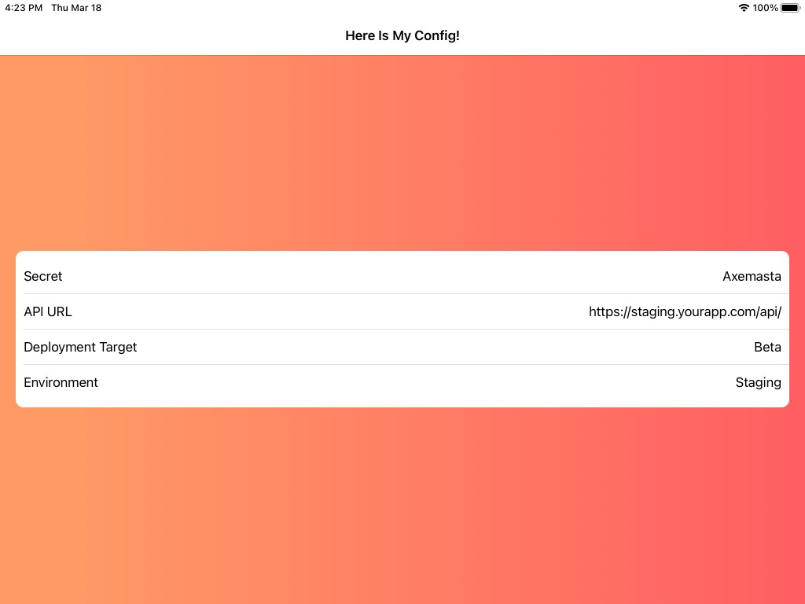
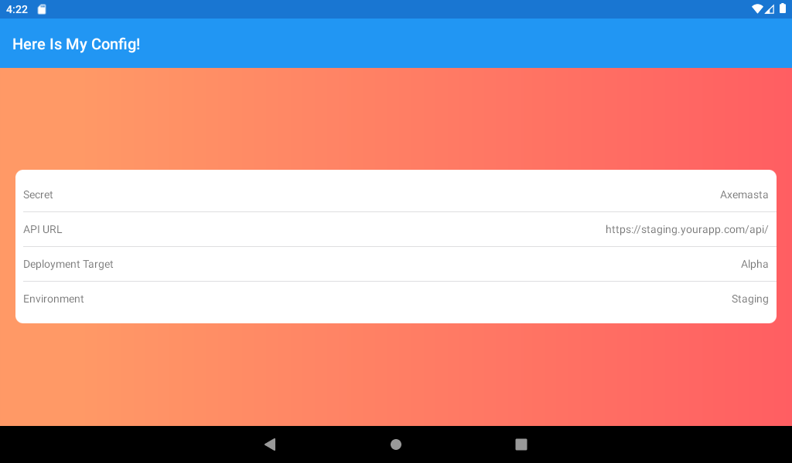

# Local Config In Xamarin Forms

We love config ❤️ We love Xamarin Forms 💗 We love Config in Xamarin Forms 😍 💗❤️

This sample project is a proof on concept intended to demonstrate how you can deploy your Xamarin Forms app with a local config file. This solution utilizes native resources that **DO NOT** get compiled, so you can alter their values after you have compiled the apps. This is useful when deploying an app between different environments, imagine the following scenario:

- You work on your app whilst running a self hosted API (`localhost:8000/api`)
- You build & deploy your alpha app to your staging environment (`https://staging.yourapp/api`)
- You build & deploy your beta app to TestFlight, pointed at staging (`https://staging.yourapp/api`)
- You build & deploy your production app to the App Store, pointed at production(`https://prod.yourapp/api`)

For those of you that value your time & value your precious pipeline minutes, you don't want to be build & deploying your app 2-3 times across your deployment pipeline. Instead we can use local config files and command line tools to update the configuration of our apps without having to rebuild them!

The idea is to build the app once in your CI pipeline and then unpack, update the config, repack and resign the apps depending on their target environment (alpha / beta / prod).

For this repo I haven't included any pipeline yaml, this process is documented for ios [here](http://chamindac.blogspot.com/2018/10/resigning-and-deploying-xamarin-ios.html). For Android you will have to figure it out for now, I will have to update this repo later... 🙈.


## Sample App

The sample app provided uses the class `IConfigManager` to handle reading config from the app bundle. Simply load the app and view the awesome & incredible config!

| iOS                                             | Android                                                |
| ----------------------------------------------- | ------------------------------------------------------ |
|  |  |


### Config Locations

Each config file is located in the platform specific project. In this example the config is duplicated across each project, someone less lazy than me could easily use an msbuild task to copy a single file from the main project to each specific project 😉

#### iOS

| Key          | Value                    |
| ------------ | ------------------------ |
| Config Path  | `/Resources/config.json` |
| Build Action | `BundleResource`         |


##### Notes

I have also included an example of using a `plist` file instead. Whilst nice and cocoa'y, parsing this file is a little annoying because you have to convert it from an `NSDictionary` to whatever format you want your object in. I couldn't find any built in mechanisms for this so did a bit of reflection in this example. Its not ideal in my opinion, you can store the data as JSON which occupies less space in the bundle and is much more conveniently parsed by `Newtonsoft.JSON`.


#### Android

| Key          | Value                 |
| ------------ | --------------------- |
| Config Path  | `/Assets/config.json` |
| Build Action | `AndroidAsset`        |


##### Notes

I have also included an example of loading configuration from Android Resources. If you find the file `/Resources/values/config.xml` you will see a resource file with the config I included in the JSON file. You can find an example of how to parse these values in the project. Unfortunately these values get compiled by Android and the file only exists in your source code, making this config method unsuitable for the requirement.


## Change iOS IPA Config

//Todo

## Change Android APK Config

A compiled Android apk can be unpacked, config can be edited and repacked and resigned using the `apktool` tool. This article documents the stpes neccessary to alter and redeploy an android apk.


### Requirements

- Android APK
- Signing Identity (keystore)
- [`apktool`](https://ibotpeaches.github.io/Apktool/) installed locally


### Steps

1. Copy the apk to a location & open a terminal at the folder

2. Unpack the apk

   ```shell
   apktool d {{apkname}} -o extracted_apk
   ```

3. Modify the contents of the apk however you want. In my case I am altering a config file in the /assets folder.

4. Repack the apk

   ```shell
   apktool b extracted_apk -o app-release-mod.apk
   ```

   *this will create an apk in the root folder called app-release-mod.apk*

5. Sign the apk with your chosen keystore

   ```shell
   jarsigner -verbose -sigalg SHA1withRSA -digestalg SHA1 -keystore {{keystorepath}} {{apkname}} {{aliasname}} -storepass {{keystorepassword}}
   ```

6. Alternatively you can sign using the uber apk signer tool:

   ```shell
   java -jar {{path_to_jar}} --apks {{path_to_apk}}
   ```


The apk can now be deployed to an android device / emulator. Running the app will display the new configuration for the app.


### Sources

- [Repackaging to Change App Configuration](https://nicksnettravels.builttoroam.com/repack-android-app/)
- [APKTOOL](https://ibotpeaches.github.io/Apktool/)
- [How to Sign an Already Compiled Apk](https://stackoverflow.com/questions/10930331/how-to-sign-an-already-compiled-apk)
- [Uber Apk Signer](https://github.com/patrickfav/uber-apk-signer)